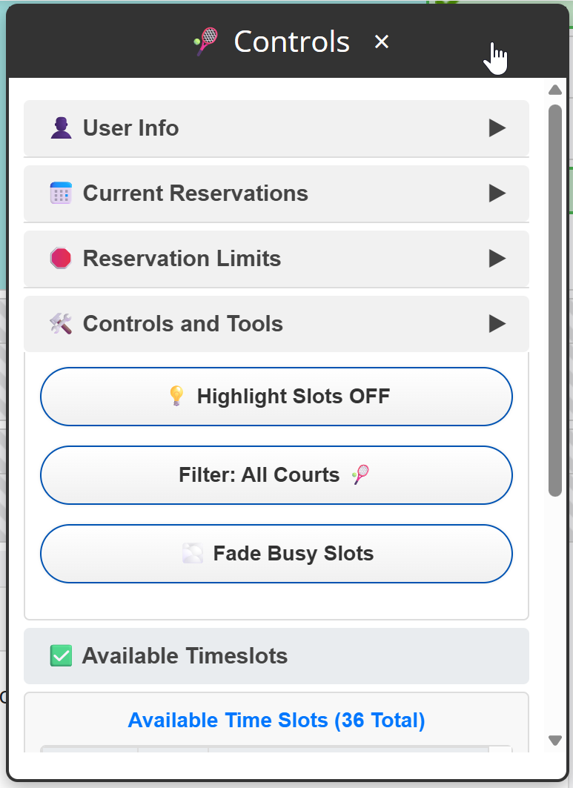
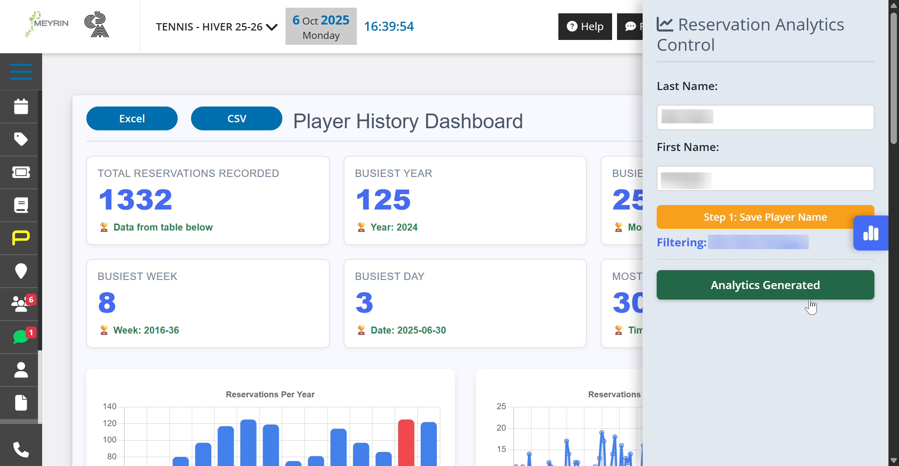

# cs-maisonnex
The files in this repo are TamperMonkey scripts that require the right browser extension.

See the following website for info:
https://www.tampermonkey.net/

The scripts below only work for the Plugin.ch instance for the members of the Centre Sportif of Maisonnex:
https://cs-maisonnex.ch/

The repo contains 2 scripts.
1. Additional Tools  
Adds a side panel menu with options to see current reservations, limits and available timeslots. The panel also includes 3 buttons to toggle the available timeslots, show indoor vs outdoor vs all courts (for CS Mainsonnex only) and to toggle the busy slots and hide the name(s) of other players' reservations.

[Download or view the video](assets/chrome_VO3EqLCrOV.mp4)

2. History Stats  - Deprecated
[Note - as of 8 October 2025 - these have been implemented directly in the platform] 
Adds a side palnel prompting the player to enter their name and generate the statistics for number of times played, by week, by hours, by year as well as a top 10 partners table. 

[Download or view the video](assets/chrome_eejo4gbObP.mp4)

